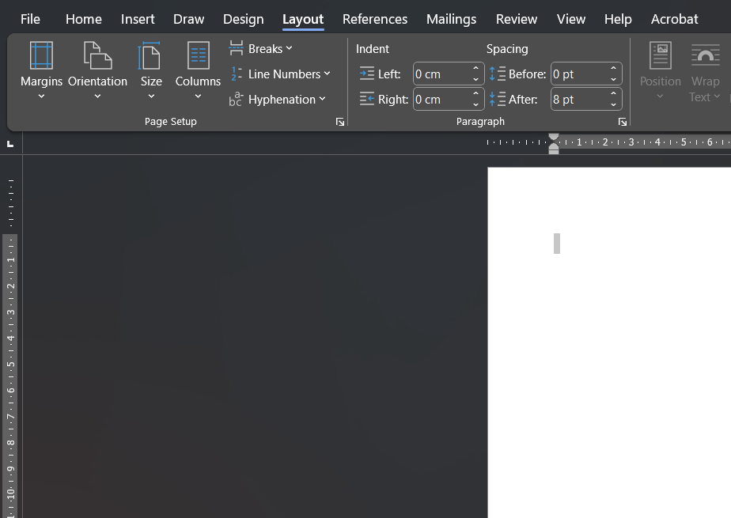
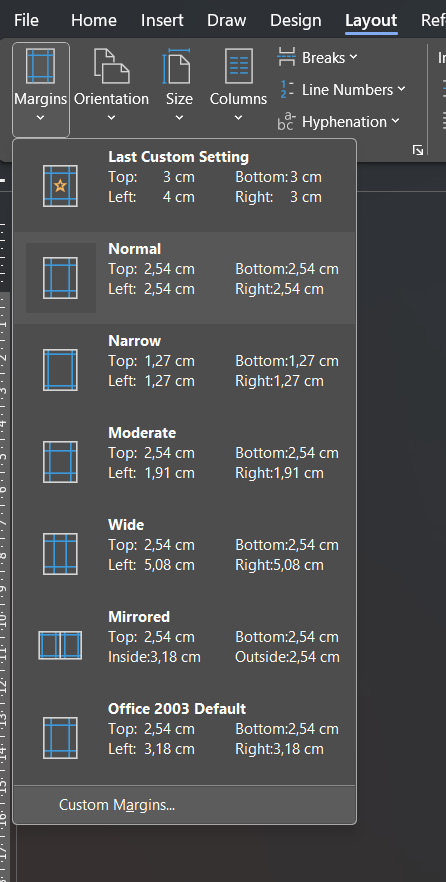
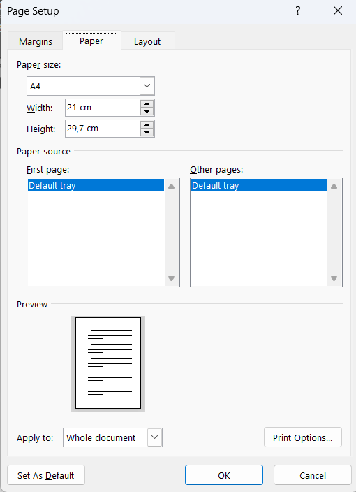
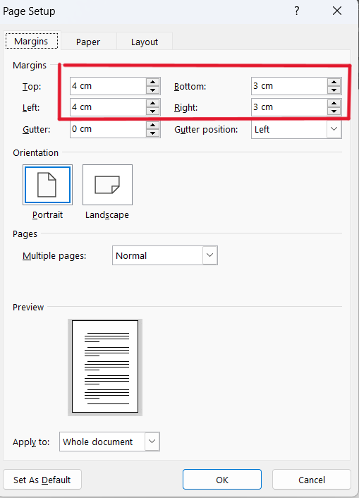
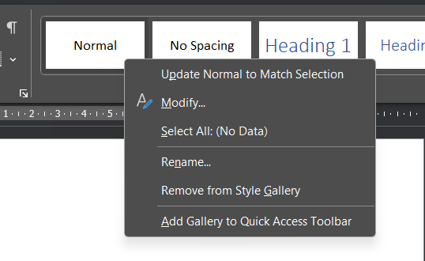
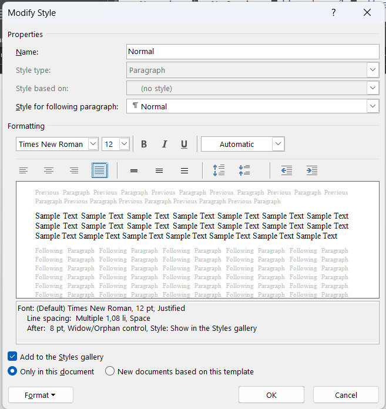
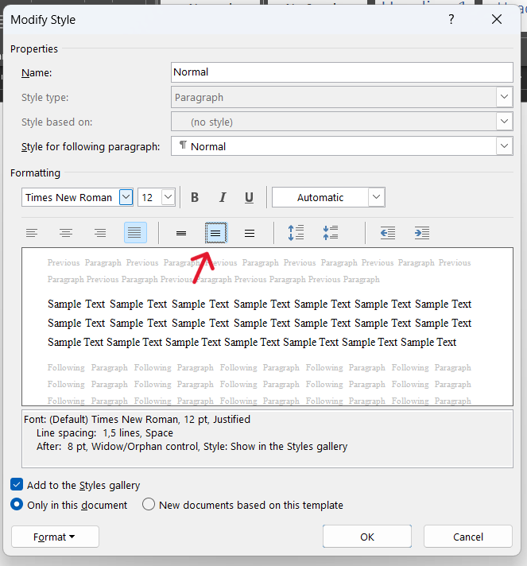

# Standar Format Penulisan Makalah di Word

## Konten tabel
- [Kertas](#kertas)
- [Margin](#margin)
- [Jenis Font](#jenis-font)
- [Ukuran Spasi](#ukuran-spasi)
- [Heading](#heading)

## Kertas

Kertas yang digunakan untuk penulisan makalah di Word menggunakan format kertas `A4` dengan lebar `21cm` dan tinggi `29,7cm`.

Pilih menu `layout` kemudian masukkan ke tool `margins`:

Klik costume margins:

Setelah itu atur Paper-nya:

## Margin

Format penulisan margin pada makalah yang digunakan secara umum adalah 4-4-3-3.

    kiri = 4
    atas = 4
    kanan = 3
    bawah = 3

Pilih menu `layout` kemudian masukkan ke tool `margins`:

Klik costume margins:

Setelah itu atur Margins-nya `4-4-3-3`:

## Jenis Font

Jenis font yang digunakan pada makalah biasanya `Times New Roman` dengan ukuran `12`.

Klik kanan pada `Normal` kemudian klik menu `Modify`:

Kemudian modify style ubah font ke `Times New Roman` ukuran font `12` dan align `justify`:

## Ukuran Spasi

Spacing atau spasi adalah jarak antar-baris dalam penulisan. Ukuran spasi pada makalah umumnya menggunakan `1,5`.

