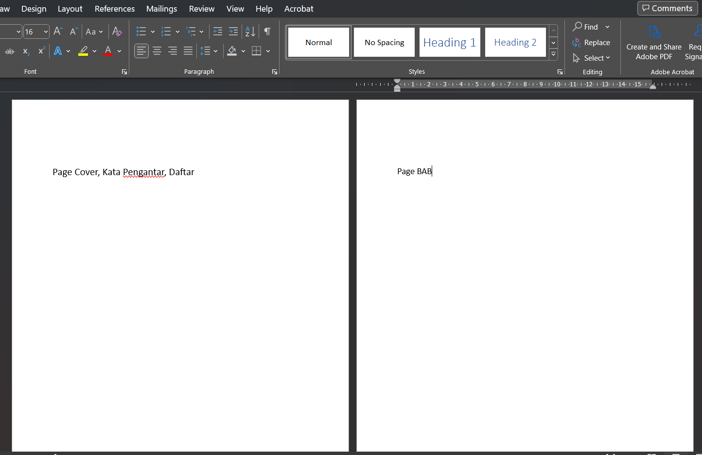

# Standar Format Penulisan Makalah di Word

## Konten tabel
- [Download Template](template/template_format_makalah.docx)
- [Kertas](#kertas)
- [Margin](#margin)
- [Jenis Font](#jenis-font)
- [Ukuran Spasi](#ukuran-spasi)
- [Heading](#heading)
- [Page Breaks](#page-breaks)
- [Daftar Isi Otomatis](#aftar-isi-otomatis)

## Kertas

Kertas yang digunakan untuk penulisan makalah di Word menggunakan format kertas `A4` dengan lebar `21cm` dan tinggi `29,7cm`.

Pilih menu `layout` kemudian masukkan ke tool `margins`:

Klik costume margins:

Setelah itu atur Paper-nya:

## Margin

Format penulisan margin pada makalah yang digunakan secara umum adalah 4-4-3-3.

    kiri = 4
    atas = 4
    kanan = 3
    bawah = 3

Pilih menu `layout` kemudian masukkan ke tool `margins`:

Klik costume margins:

Setelah itu atur Margins-nya `4-4-3-3`:

## Jenis Font

Jenis font yang digunakan pada makalah biasanya `Times New Roman` dengan ukuran `12`.

Klik kanan pada `Normal` kemudian klik menu `Modify`:

Kemudian modify style ubah font ke `Times New Roman` ukuran font `12` dan align `justify`:

## Ukuran Spasi

Spacing atau spasi adalah jarak antar-baris dalam penulisan. Ukuran spasi pada makalah umumnya menggunakan `1,5`.

## Heading

Heading digunakan untuk membuat halaman BAB dan Sub Bab.

Langkah pertama klik tool `Multilevel List` kemudian klik `Define New Multilevel List`:

Klik `More` untuk mendapatkan lebih banyak modifikasi:

Kita akan atur `Heading 1` untuk sebuah BAB:

Kemudian Atur untuk `Heading 2` untu Sub Bab:

## Page Breaks

Page Breaks digunakan untuk membedakan antara Page `Cover, Kata Pengantar, Daftar` dengan Page `BAB`:

Pisahkan page seperti berikut ini:

Klik `Next Page` untuk memisahkan page:

Setelah `Next Page` di-klik maka akan dibuatkan satu page baru yang berbeda dengan page awal

Kemudian Anda dapat membedakan antara Page Daftar dan Page BAB:

## Daftar Isi Otomatis

Daftar isi otomatis digunakan untuk membuat sebuah daftar isi yang dimana kita tidak perlu mengatur daftar halaman tersebut secara, kita hanya meng-update untuk membuat perubahan pada Daftar isi.

Langkah awal klik menu `References` kemudian klik `Table of Contents` lalu pilih `Automatic Table 2`:

Setelah itu, maka akan muncul `Table of Contents` pada halaman yang dipilih. Kemudian Anda dapat mengganti `Table of Contents` menjadi `Daftar Isi` dengan menggunakan `Heading 1`:

